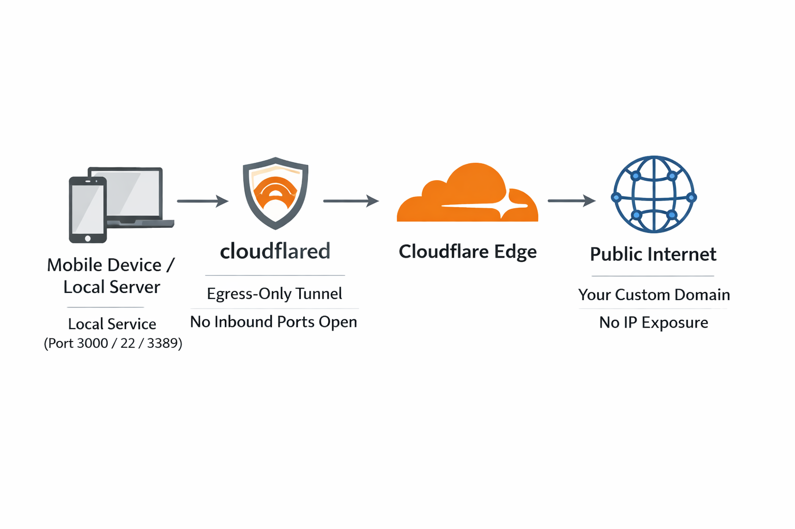

# HostingMobile

**Host services directly from mobile devices and CG-NAT networks with zero infrastructure costs.**

[](https://github.com/stringmanolo/hostingmobile)
[](https://github.com/stringmanolo/hostingmobile)



---

## Overview

HostingMobile enables you to expose local services (HTTP/HTTPS, SSH, RDP, TCP, ...) from any device behind Carrier-Grade NAT (CG-NAT) or other networks without port forwarding, public IPs, or server infrastructure. All traffic is routed through Cloudflare's edge network with end-to-end encryption. Only 5 steps.

### Key Features
- **CG-NAT Bypass**: Works behind mobile data, ISP restrictions, and corporate firewalls
- **Zero Infrastructure**: No VPS, no dedicated server, no subscription fees
- **Protocol Agnostic**: Native support for HTTP, SSH, RDP, TCP, and UDP via QUIC
- **Production-Ready**: Custom domain support with free SSL certificates
- **Cross-Platform**: Termux, Android, Linux, Raspberry Pi

---

## Prerequisites

- **Cloudflare account** (free, no credit card required)
- **Domain name** (free options provided below)
- **Linux terminal environment** (Termux + proot-distro, or native Linux or Windows)
- **Node.js** (optional, for sample server)

> This guide is not for Windows, but you can follow along and figure it out

---

## Step 1: Domain Acquisition

### Option A: DigitalPlat (Recommended - Instant Approval)
DigitalPlat provides free domains after Freenom's closure:

1. Register at [DigitalPlat FreeDomain](https://domain.digitalplat.org)
2. Complete GitHub OAuth verification
3. Register domain: `yourproject.dpdns.org`
4. Set nameservers to Cloudflare (obtained in Step 2)

**Why DigitalPlat?**
- ✅ Instant activation (no waiting)
- ✅ Full DNS control
- ✅ CG-NAT compatible
- ✅ No credit card required

### Option B: EU.org (Stable but Slow)
For long-term projects:
1. Submit request at [nic.eu.org](https://nic.eu.org/)
2. **Wait ~2 months** for manual processing
3. Configure Cloudflare nameservers after approval

### Option C: DuckDNS (Subdomain Fallback)
If you cannot obtain a TLD:
1. Register at [DuckDNS.org](https://www.duckdns.org)
2. Create subdomain: `yourproject.duckdns.org`
3. **Limitation**: Cannot use Cloudflare proxy (direct Tunnel only)

---

## Step 2: Cloudflare DNS Configuration

1. **Add your domain** to Cloudflare Dashboard
2. **Select Free Plan** and continue
3. **Copy the two assigned nameservers** (format: `name.ns.cloudflare.com`)
4. **Configure nameservers at your domain registrar**:
5. **Wait for propagation**: 2 minutes to 48 hours
6. **Verify in Cloudflare**: Status shows **"Active"**

---

## Step 3: Install Cloudflared CLI

### Termux (Android)
```bash
# Download latest ARM binary
# For 64 bits ARM Architecture
curl -L "https://github.com/cloudflare/cloudflared/releases/latest/download/cloudflared-linux-arm64" -o cloudflared
# For 32 bits ARM Architecture (old smartphones)
curl -L "https://github.com/cloudflare/cloudflared/releases/latest/download/cloudflared-linux-arm" -o cloudflared

# Give it permissions to run
chmod +x cloudflared

# Make it a global command
mv cloudflared ~/../usr/bin/

# Test it works
cloudflared --version
```

### Debian/Ubuntu/GNU-Linux
```bash
curl -L "https://github.com/cloudflare/cloudflared/releases/latest/download/cloudflared-linux-amd64" -o cloudflared
chmod +x cloudflared
sudo mv cloudflared /usr/local/bin/
```

---

## Step 4: Quick Test (Temporary URL)

**Purpose**: Verify connectivity before permanent setup.

1. **Start sample server** (or your own service):
```bash
# Clone repository
git clone https://github.com/stringmanolo/hostingmobile
cd hostingmobile
npm install
node index.js &
```

2. **Launch temporary tunnel**:
```bash
cloudflared tunnel --url http://localhost:3000
```

3. **Access the provided URL** (format: `https://random-words.trycloudflare.com`)
4. **Expected result**: "Hello World from behind CG-NAT!"

⚠️ **Critical**: `trycloudflare.com` URLs change on every restart. Proceed to Step 5 for permanent solution.

---

## Step 5: Persistent Tunnel with Custom Domain

### 1. Authenticate Cloudflared
```bash
cloudflared tunnel login
# Follow browser prompt and select your domain
```

### 2. Create Named Tunnel
```bash
cloudflared tunnel create hostingmobile-tunnel # swap hostingmobile for the name of your proyect / web / service
# Save the UUID: a1b2c3d4-e5f6-7890... and never share it 
```

### 3. Route DNS
```bash
cloudflared tunnel route dns hostingmobile-tunnel your-domain.org
# or do it using the web at https://dash.cloudflare.com/173763727228282828/your.domain.dpdns/dns/records by going to your domain, clicking the dots and creating a new dns record for your domain. 
# Select CNAME and add the subdomain (for example: cgnat-bypass.stringmanolo.dpdns) and put your UUID.cfargotunnel.com as the target and create the record. For example: 1a11111a-11a1-1a11-a1a1-aa1aa11a11aa.cfargotunnel.com
```

### 4. Create Configuration File
```bash
# Use your favourite text editor.
vi ~/.cloudflared/config.yml
```

**Paste this configuration** (replace values by yours):
```yaml
tunnel: cgnat-bypass
credentials-file: /root/.cloudflared/1a11111a-11a1-1a11-a1a1-aa1aa11a11aa.json
ingress:
  - hostname: cgnat-bypass.stringmanolo.dpdns
  service: http://localhost:3000
  - service: http_status:404
```

### 5. Run the Service

```bash
# Start your server in the background if you did step 4. 
node index.js & # This will start a basic HelloWorld http server at port 3000

# Start the routing with the config file
cloudflared tunnel --config config.yml run
```

> **You are done:** Your service should be reachable. You can install apache, nginx, postgresql, etc and configure it like a normal hosting server.
---

## Step 6: Exposing Additional Protocols

Cloudflare Tunnel supports **any TCP-based service**:

```yaml
ingress:
  - hostname: ssh.your-domain.org
    service: ssh://localhost:22
  - hostname: rdp.your-domain.org
    service: rdp://localhost:3389
  - hostname: tcp.your-domain.org
    service: tcp://localhost:8080
  - hostname: your-domain.org
    service: http://localhost:3000
  - service: http_status:404
```

> Make sure to create the CNAME record for each subdomain.
  
> _You can use tcp:// for any of them, but using the name of the protocol (example ssh://) allows Cloudflare to help you secure a bit the protocol by default_

> I think cloudflare do not support UDP protocol in the free tier plan. You can use tools like [Chisel](https://github.com/jpillora/chisel) to encapsulate the trafic over tcp. Make sure it dosn't break Cloudflare TOS to don't catch a ban

**Security Note**: For SSH/RDP, enable **Cloudflare Access** (Zero Trust) to prevent brute-force attacks.

---

## Step 7: Verification & Monitoring

### Verify Tunnel Status
```bash
# Real-time logs
journalctl -u cloudflared -f

# Tunnel information
cloudflared tunnel info hostingmobile-tunnel
```

### External Verification
You can use free services like **urlscan.io** for a quick confirm of public accessibility:
```bash
https://urlscan.io/
```

> You can check mine to see what it should look like: https://urlscan.io/result/019b3f06-2816-7068-8904-456b13c9fd90/


### Uptime Monitoring (Free)
Configure **UptimeRobot** to monitor `your-domain.org` and receive alerts if the tunnel goes down.

---

## Security Best Practices

### 1. Enable Cloudflare Access (Zero Trust)
Restrict SSH/RDP to authenticated users:
```bash
# Configure in Cloudflare Dashboard → Zero Trust → Applications
```

### 2. Force HTTPS
Cloudflare provides free SSL certificates. Enable **"Always Use HTTPS"**:
```bash
# Cloudflare Dashboard → SSL/TLS → Edge Certificates
```

### 3. Hide Server Headers
In your service, strip identification headers:
```javascript
response.headers.delete('x-powered-by');
response.headers.delete('server');
```

### 4. Rate Limiting
Create a Cloudflare Worker to protect against abuse:
```javascript
addEventListener("fetch", (event) => {
  event.respondWith(handleRequest(event.request));
});

async function handleRequest(request) {
  // Rate limiting logic here
  return fetch(request);
}
```

---

## Troubleshooting

### Domain Not Resolving
```bash
# Check DNS propagation
dig +short ns your-domain.dpdns

# If stuck, re-create route or try using the web to create a new record
cloudflared tunnel route dns hostingmobile-tunnel your-domain.org
```

### Tunnel Connection Refused
```bash
# Verify local service is listening by entering next address on your browser
http://localhost:3000 

# Check cloudflared logs
journalctl -u cloudflared -n 50 --no-pager
```

### Permission Issues
```bash
# Fix permissions
chown -R ~/.cloudflared
```

---

## Cost Breakdown

| Component | Cost | Notes |
|-----------|------|-------|
| **Domain (DigitalPlat)** | €0 | Free with GitHub verification |
| **Cloudflare** | €0 | Free tier (unlimited tunnels) |
| **Cloudflared** | €0 | Open-source |
| **SSL Certificate** | €0 | Auto-provisioned |
| **Bandwidth** | €0 | 100GB/month included |

**Total: €0 permanent infrastructure**

---

## Contributing

Contributions are welcome! Focus areas:
- Automated setup scripts for multiple platforms
- Additional protocol examples (UDP, QUIC)
- Security hardening guides
- Alternative registrar integration

---

**Project Goal**: Enable anyone to host services from mobile/CG-NAT networks with zero infrastructure costs.
